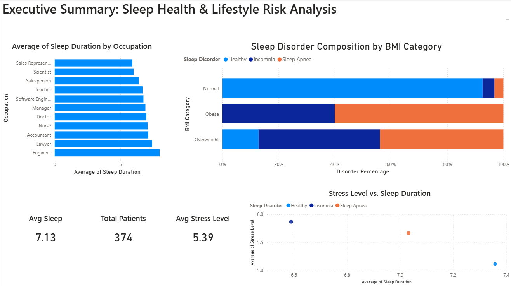

# Sleep Disorder Classification & Health Analysis

## Project Overview
This project uses statistical learning techniques in **R** to classify individuals into three sleep categories: *None*, *Insomnia*, or *Sleep Apnea*. The goal was to identify lifestyle factors that most strongly predict sleep health issues.

## Key Results
- **Top Performance:** Achieved **~89% accuracy** on the test set using both **Random Forest** and **Multinomial Logistic Regression** models.
- **Key Predictors:** Feature importance analysis revealed that **BMI Category** and **Sleep Duration** are the primary drivers of sleep disorders.
- **Methodology:** Handled multicollinearity between blood pressure variables and implemented a 70/30 train-test split for valid model evaluation.

## Interactive Dashboard

*Figure 1: Power BI Executive Summary showing the correlation between BMI and Sleep Disorders.*

## Files Included
- `sleep_analysis.R`: The full R script including data cleaning (Caret), visualization (ggplot2), and modeling.
- `FINAL_PROJECT_STAT385.pdf`: The comprehensive academic report detailing the statistical findings.
